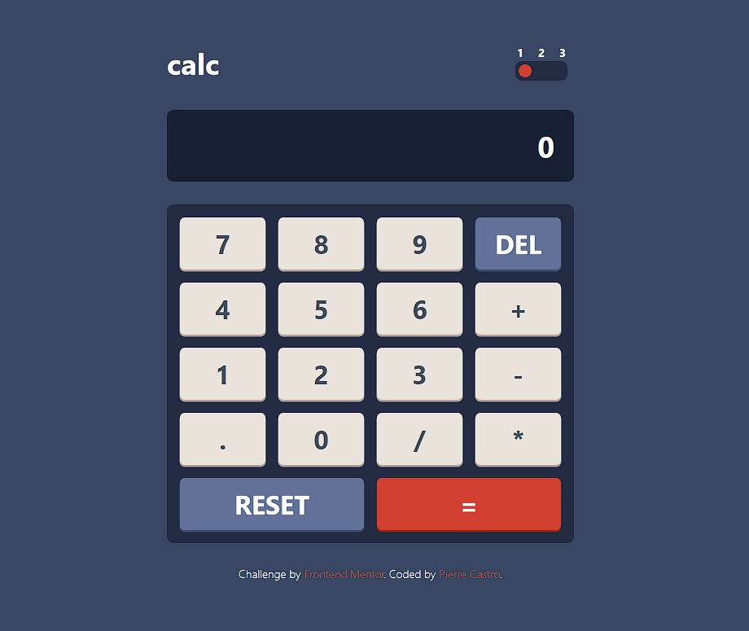
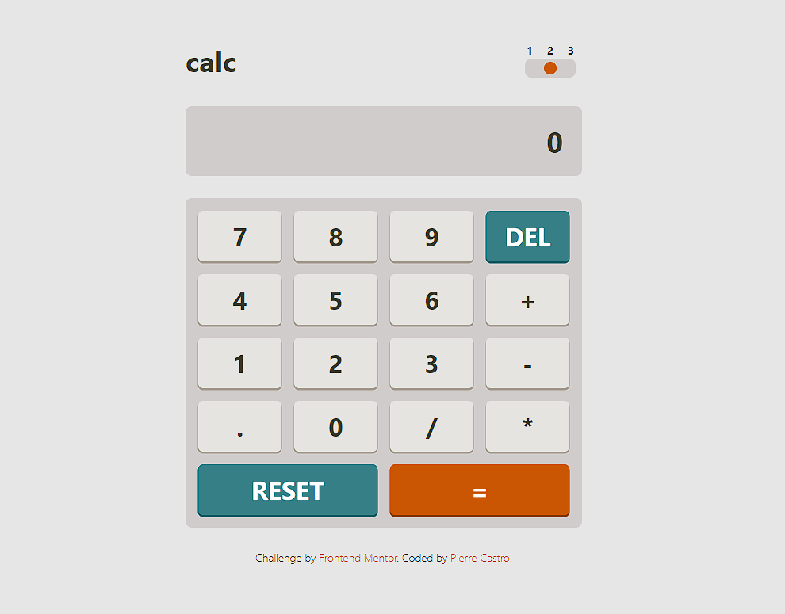
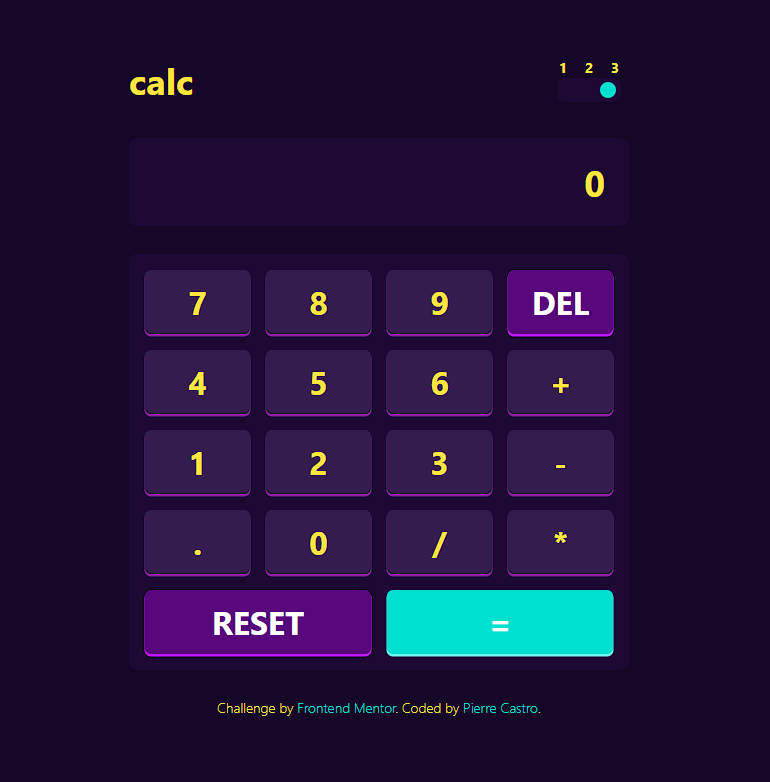

# Frontend Mentor - Calculator app solution

This is a solution to the [Calculator app challenge on Frontend Mentor](https://www.frontendmentor.io/challenges/calculator-app-9lteq5N29).

## Table of contents

- [Overview](#overview)
  - [The challenge](#the-challenge)
  - [Links](#links)
- [My process](#my-process)
  - [Built with](#built-with)
  - [What I learned](#what-i-learned)
- [Author](#author)

## Overview

### The challenge

Users should be able to:

- See the size of the elements adjust based on their device's screen size
- Perform mathmatical operations like addition, subtraction, multiplication, and division
- Adjust the color theme based on their preference
- **Bonus**: Have their initial theme preference checked using `prefers-color-scheme` and have any additional changes saved in the browser --- _not done yet_

### Links

- Solution URL: [Add solution URL here](https://your-solution-url.com)
- Live Site URL: [Add live site URL here](https://your-live-site-url.com)

## My process

### Built with

- [Tailwind CSS](https://tailwindcss.com/) - CSS framework
- [React](https://reactjs.org/) - JS library
- [Vite.js](https://vitejs.dev/)

### What I learned

In this project, I learned how to manage state transitions efficiently by using the React hook [useReducer](https://react.dev/reference/react/useReducer).

I also learned the basics of the [Tailwind CSS](https://tailwindcss.com/) framework, how to create custom classes (for colors, font size, or any CSS property) using the **extend** feature. With this, i was able to create three themes that users can select.

## Author

- Frontend Mentor - [@pierre-castro](https://www.frontendmentor.io/profile/pierre-castro)
